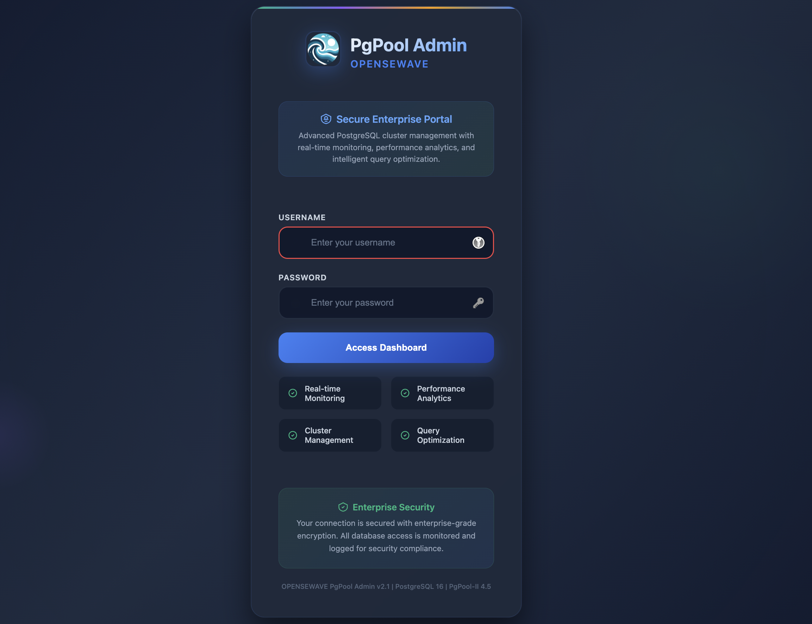
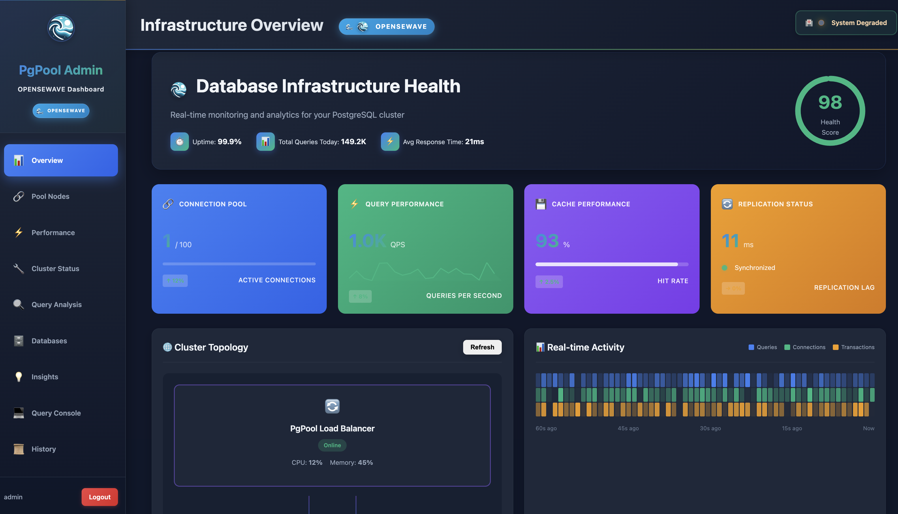
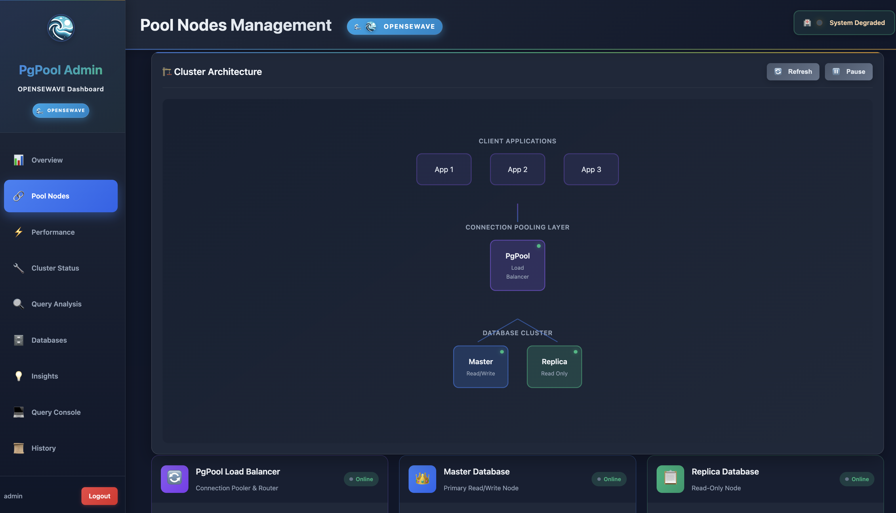
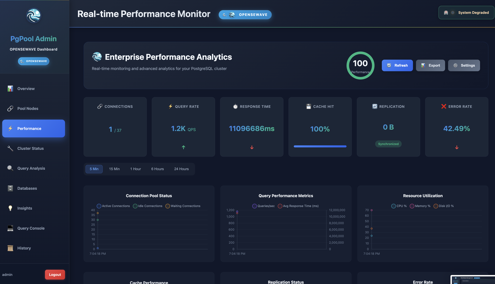
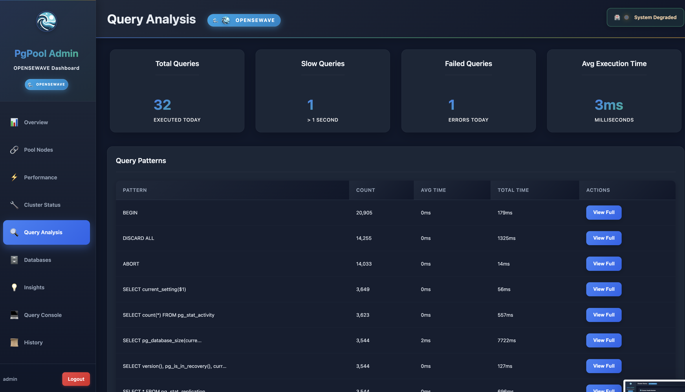

# PostgreSQL Master-Replica with PgPool-II and Admin Interface

> **⚠️ Development Status**: This project is under active development and not yet ready for production use. If you'd like to use it or contribute to finish the missing features, you are welcome!

A PostgreSQL cluster setup with master-replica replication, PgPool-II load balancing, and a comprehensive web-based administration interface.

## Features

- **High Availability PostgreSQL Cluster** with automatic failover
- **Advanced Web Admin Interface** with real-time monitoring
- **Connection Pooling & Load Balancing** via PgPool-II
- **Streaming Replication** for data redundancy
- **Performance Analytics** and query optimization insights

## Architecture

```
┌─────────────────┐     ┌─────────────────┐     ┌─────────────────┐
│ Client Apps     │────▶│   PgPool-II     │────▶│ Master (RW)     │
└─────────────────┘     │ Load Balancer   │     └─────────────────┘
                        │ Port: 6436      │              │
                        └─────────────────┘              │ Streaming
                                 │                       │ Replication
                                 └──────────────▶┌─────────────────┐
                                                │ Replica (RO)     │
┌─────────────────┐                            └─────────────────┘
│ PgPool Admin    │
│ Port: 9000      │
└─────────────────┘
```

## Quick Start

### Prerequisites

- Docker and Docker Compose v2.0+
- 8GB RAM minimum
- Ports: 6435, 6436, 6437, 9000

### Installation

1. **Clone the repository**
   ```bash
   git clone <repository-url>
   cd PgPool
   ```

2. **Create `.env` file**
   ```env
   # PostgreSQL Configuration
   POSTGRES_DB=appdb
   POSTGRES_USER=appuser
   POSTGRES_PASSWORD=SecurePass123!

   # Admin Interface
   PGPOOL_ADMIN_USERNAME=admin
   PGPOOL_ADMIN_PASSWORD=AdminPass456!
   ```

3. **Start the cluster**
   ```bash
   docker-compose up -d
   ```

4. **Access Admin Interface**
   - URL: http://localhost:9000
   - Login with credentials from `.env`

## Usage

### Database Connections

```bash
# Via PgPool (Load Balanced) - Recommended
psql -h localhost -p 6436 -U appuser -d appdb

# Direct to Master (Read/Write)
psql -h localhost -p 6435 -U appuser -d appdb

# Direct to Replica (Read-Only)
psql -h localhost -p 6437 -U appuser -d appdb
```

### Admin Interface Features

- **Dashboard**: Real-time cluster health and metrics
- **Pool Nodes**: Visual topology and node management
- **Performance Monitor**: Live performance analytics
- **Query Analysis**: Query patterns and optimization
- **Query Console**: Interactive SQL execution
- **Insights**: AI-powered recommendations

## Screenshots

<details>
<summary>Click to view screenshots</summary>

| Feature | Screenshot |
|---------|------------|
| Login |  |
| Dashboard |  |
| Pool Nodes |  |
| Performance |  |
| Query Analysis |  |

</details>

## Maintenance

### Common Commands

```bash
# Check cluster status
docker-compose ps

# View logs
docker-compose logs -f [service-name]

# Backup database
docker exec -t pg-master pg_dump -U appuser appdb > backup.sql

# Check replication
docker exec -it pgpool psql -h localhost -p 5432 -U appuser -c "show pool_nodes"
```

### Troubleshooting

<details>
<summary>Common issues and solutions</summary>

**Replica not syncing**
```bash
docker-compose logs postgres-replica
docker-compose restart postgres-replica
```

**Connection issues**
```bash
docker exec -it pgpool psql -h localhost -p 5432 -U appuser -c "SELECT 1"
docker-compose restart pgpool
```

**Port conflicts**
```bash
# Check port usage
lsof -i :6436
# Update ports in docker-compose.yml
```

</details>

## API Endpoints

The admin interface provides REST APIs:
- `/api/pool_nodes` - Pool nodes status
- `/api/performance_metrics` - Performance data
- `/api/query_statistics` - Query stats
- `/api/cluster_status` - Cluster health

[Full API documentation →](docs/API.md)

## Contributing

We welcome contributions! Areas needing work:
- [ ] Automated failover testing
- [ ] Enhanced monitoring features
- [ ] Query optimization advisor
- [ ] Backup automation
- [ ] SSL/TLS configuration

See [CONTRIBUTING.md](CONTRIBUTING.md) for guidelines.

## License

This project is licensed under the MIT License - see [LICENSE](LICENSE) file.

## Support

- **Issues**: [GitHub Issues](https://github.com/your-repo/issues)
- **Documentation**: Check `/docs` folder
- **Community**: Join our discussions

---

Made with ❤️ by the community